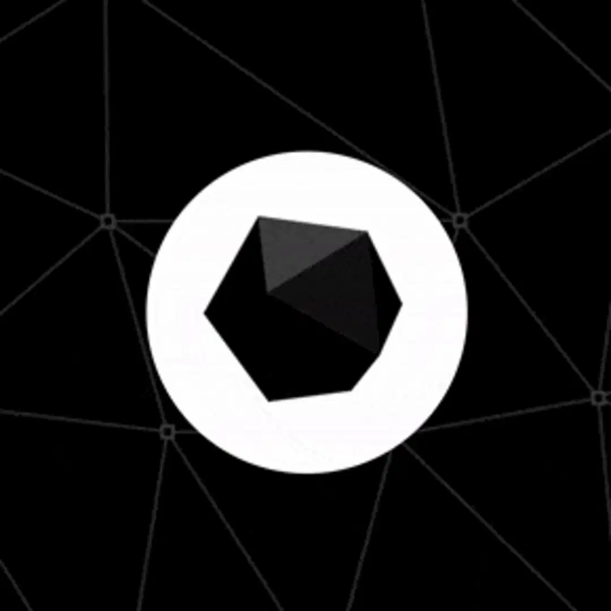

#### *A language for humans and computers*

*Andrea Manzini*

**11/11/2023**

`DevFest Trento`

<!-- paginate: false -->

---
<!-- paginate: true -->

## Andrea Manzini

- Who ? ➡️ https://ilmanzo.github.io 
- What ? ⬇️

Software Engineer + Package Maintainer @ [SUSE](www.suse.com)

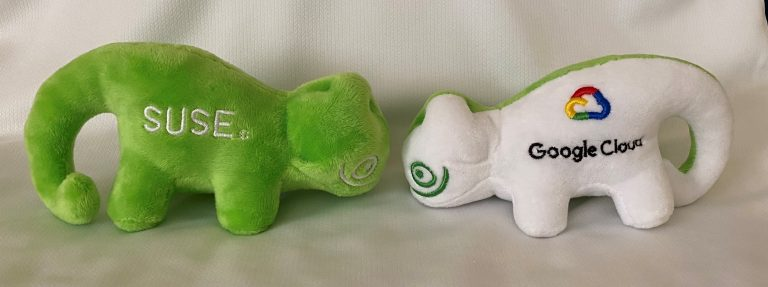

<!-- _footer: "" -->
---
## Why I'm here ?

- Open Source enthusiast && contributor
- Knowledge sharing
- Crystal [Ambassador](https://forum.crystal-lang.org/t/ambassador-introductions/5734)

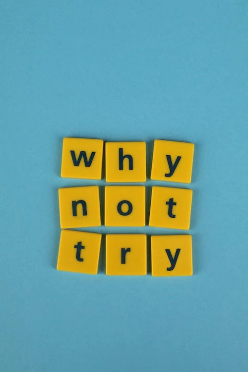

---
# Crystal is ...

## A language for Humans 🧑

- Clean code
- Batteries included
- Avoid surprise fail
- No *bureaucracy*

---
task: print 'Hello' 3 times

#### once upon a C  ... 

```C
int i = 0
while(i < 3) {
  printf("Hello\n");
}
```
😵 ... can you spot the error ?


---
### Clean Code?

    main.c:5:1: error: expected ‘,’ or ‘;’ before ‘while’

```C
int i = 0;
while(i < 3) {
  printf("Hello\n");
}
```
ops, I did it again ...😵


---
#### task: print 'Hello' 3 times

```C
int i = 0;
while(i < 3) {
  printf("Hello\n");
  i++;
}
```

Crystal is designed to be... Clear

```Crystal
3.times do
 print "Hello"
end
```

---
### What's Clean code ?

1. Clean code solves the problem
2. Clean code is like a well-written prose
3. Clean code is simple
4. Clean code is easy to improve
5. Clean code is tested
6. Clean code focuses on problem, not on solution

*from "[Craft Better Software](https://craftbettersoftware.com/)" by Daniel Moka*

---
#### Clean Code focuses on problem, not on solution

*"**Clean Code** tells a story of the problem it solves. If your namings contain a lot of technical jargon, then it’s probably focusing on HOW. Clean Code focuses on WHAT."*


from "[Craft Better Software](https://craftbettersoftware.com/)" by Daniel Moka

---
#### Clean Code focuses on problem, not on solution

*"Technical names such as DTOs, flags, and records are all related to specific solutions on the computer. They are code smells telling that your code focuses on a solution space. Instead, you should write code that speaks about the problem."*

from "[Craft Better Software](https://craftbettersoftware.com/)" by Daniel Moka

---
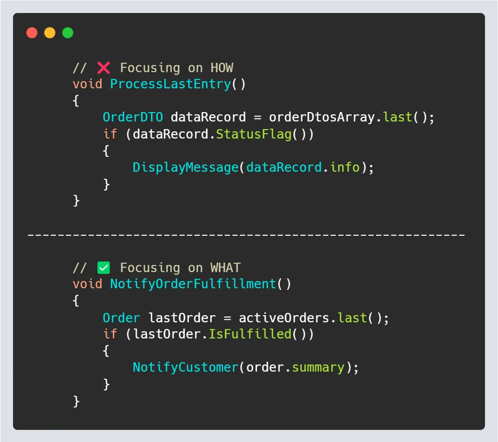

---


---

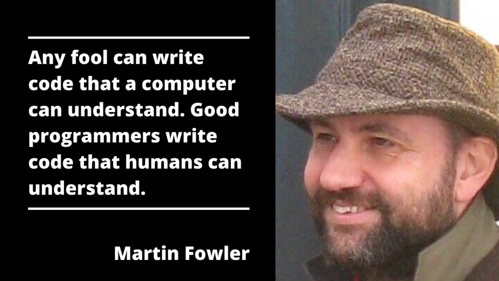

<!-- _footer: "from *Refactoring: Improving the Design of Existing Code, 1999.*" -->

---
##### Humans like their program to not randomly fail
preventing [the billion-dollar mistake](https://www.infoq.com/presentations/Null-References-The-Billion-Dollar-Mistake-Tony-Hoare/)

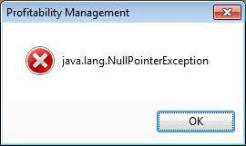
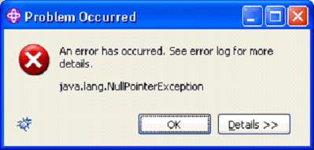
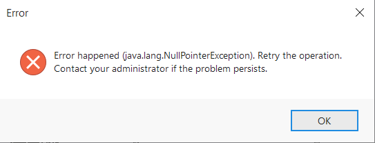
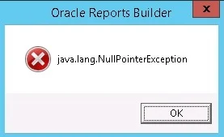

---
### Static type check on compile

```Crystal
class Duck
  def quack
    puts "🦆 quack!"
  end
end

def hatch
  Duck.new if rand(2) >= 1 # flip a coin
end

obj = hatch()
obj.quack
```
```bash
$ crystal quack.cr
Error: undefined method 'quack' for Nil (compile-time type is (Duck | Nil))
```
<!-- _footer: "" -->
---
### Bureaucracy / boilerplate ? No thanks
```Crystal
struct Nil
  def quack
    puts "shhh 🤫"
  end
end
```
```bash
$ crystal quack.cr
sshhh 🤫
$ crystal quack.cr
🦆 quack!
```
*Duck typing + monkey patching* (like in Ruby)

---
#### Human likes *batteries included* 🔋🔋
```crystal
require "http/server"

class HttpHello
  PORT = 8080

  def self.start(port = PORT)
    server = HTTP::Server.new do |context|
      context.response.content_type = "text/plain"
      context.response.print "Hello World, got #{context.request.path}!"
    end

    Log.info { "Listening on http://localhost:#{port}/" }
    server.listen port
  end
end

HttpHello.start
```
<!-- _footer: "" -->

---
# Summing up
- Pretty like Ruby
    - similar syntax, compatibility is not a goal
- Safe: statically checked types
- Has type inference
    - no need to write boilerplate types
    - duck typing and monkey patching

- Awesome community (checkout [CrystalConf!](https://crystal-lang.org/events/2023-crystal-berlin/))

---
## A language for computers

`Computers like native code` 🤖

  - performant execution
  - low memory footprint
  - cross-platform/os
  - easy to deploy

---
### performance 🚀
```ruby
def fibonacci(n)
  return n if n < 2
  fibonacci(n-1) + fibonacci(n-2)
end

puts fibonacci(47)
```
```
$ /usr/bin/time -v ruby fibonacci.rb                                             
2971215073
       	Command being timed: "ruby fibonacci.rb"
       	User time (seconds): 178.38
       	System time (seconds): 0.01
       	Elapsed (wall clock) time (h:mm:ss or m:ss): 2:58.39
  ---> 	Maximum resident set size (kbytes): 23296 <---
       	Average resident set size (kbytes): 0
       	Major (requiring I/O) page faults: 0
       	Minor (reclaiming a frame) page faults: 4629
```
<!-- _footer: "" -->
---
## low resource usage 🪶
```crystal
def fibonacci(n : UInt32)
  return n if n < 2
  fibonacci(n-1) + fibonacci(n-2)
end

puts fibonacci(47)
```
```
 /usr/bin/time -v ./fibonacci_cr 
        User time (seconds): 8.39
        System time (seconds): 0.00
        Elapsed (wall clock) time (h:mm:ss or m:ss): 0:08.39
  --->  Maximum resident set size (kbytes): 3328  <---
        Average resident set size (kbytes): 0
        Major (requiring I/O) page faults: 0
        Minor (reclaiming a frame) page faults: 296        
```
<!-- _footer: "" -->
---
#### Let's try with Go 

```Go
package main

import "fmt"

func fibonacci(n uint32) uint32 {
  if n < 2 {
    return n
  }
  return fibonacci(n-1) + fibonacci(n-2)
}

func main() {
  fmt.Println(fibonacci(47))
}
```


---
### Go, Crystal 🏁

```bash
$ hyperfine fibonacci_*

Benchmark 1: ./fibonacci_cr
  Time (mean ± σ):      8.563 s ±  0.081 s
  Range (min … max):    8.464 s …  8.702 s
 
Benchmark 2: ./fibonacci_go
  Time (mean ± σ):     11.376 s ±  0.176 s
  Range (min … max):   11.172 s … 11.755 s
 
Summary
  ./fibonacci_cr ran
    1.33 ± 0.02 times faster than ./fibonacci_go
```    

---
#### What about binary size ?

```bash
$ ls -lh fibonacci_*
-rwxr-xr-x 1 andrea andrea 405K Oct 28 10:45 fibonacci_cr
-rwxr-xr-x 1 andrea andrea 1.2M Oct 28 10:15 fibonacci_go
```
see also [benchmarks I](https://github.com/kostya/crystal-benchmarks-game) - [benchmarks II](https://ptimofeev.com/go-vs-crystal-perfomance/)


Most Important Note: **Distrust benchmarks!** 👈

---
Computers like many operating systems

[cross platform](https://crystal-lang.org/install/):
- MacOs
- Linux
- FreeBSD
- OpenBSD
- Windows
- Android

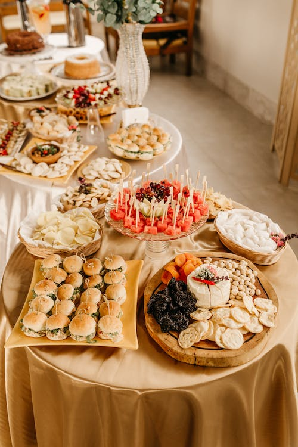

And [cross compilation](https://crystal-lang.org/reference/1.10/syntax_and_semantics/cross-compilation.html)

<!-- _footer: "" -->

---
# Some extras

- "Go style" Human friendly [concurrency](https://crystal-lang.org/reference/latest/guides/concurrency.html) via [CSP](https://en.wikipedia.org/wiki/Communicating_sequential_processes)
- Code [documentation](https://crystal-lang.org/reference/latest/syntax_and_semantics/documenting_code.html) generation
- Integrated [test](https://crystal-lang.org/reference/latest/guides/testing.html) framework
- Metaprogramming via [macros](https://crystal-lang.org/reference/latest/syntax_and_semantics/macros/index.html)
- [Shards](https://crystal-lang.org/reference/1.10/man/shards/index.html): dependency manager
- An extensive, modern [standard library](https://crystal-lang.org/api/1.10.1/)
- C-binding [without tears](https://crystal-lang.org/reference/1.10/syntax_and_semantics/c_bindings/index.html)
 
---
## "One" more thing

- There's more to Crystal: find out at https://www.crystal-lang.org

- Crystal is built on openSUSE's [Open Build Service](https://build.opensuse.org/package/show/devel:languages:crystal/crystal)

- Shameless plug: [Crystal koans](https://github.com/ilmanzo/crystal-koans) 

- If you like new languages, check out also [Nim Italia](https://nim-italia.github.io/) 


---
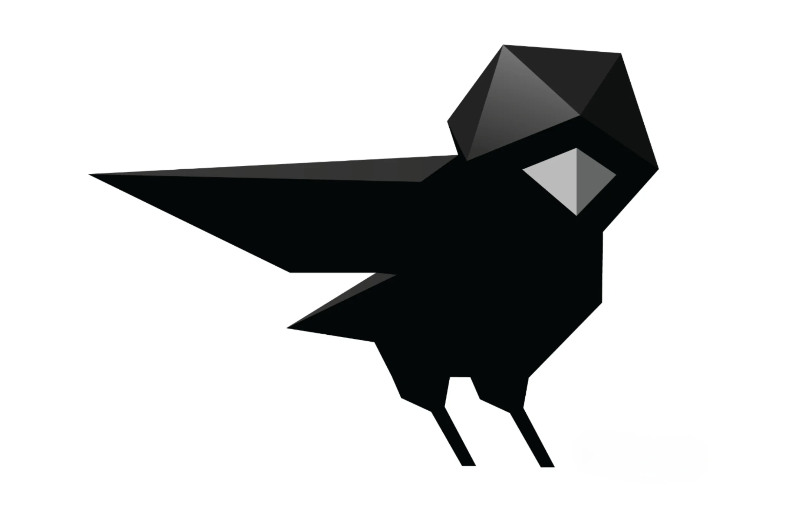

# Thanks

#### *A language for humans and computers*

*Andrea Manzini*

**11/11/2023**

`DevFest Trento`

---
These slides are available on `@ilmanzo` GitHub
https://github.com/ilmanzo


Photo Credits:

- Slide 3: [Ann H](https://www.pexels.com/@ann-h-45017/)
- Slide 25: [Jonathan Borba](https://www.pexels.com/@jonathanborba/)


## Q/A Time 