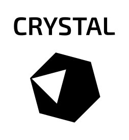
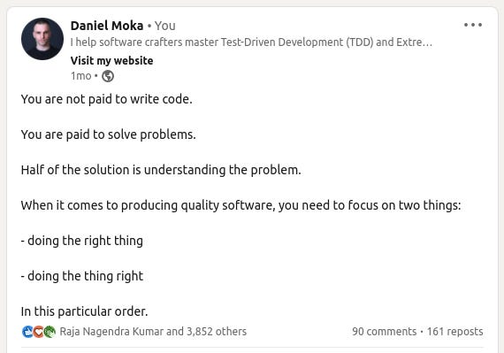

## Andrea Manzini

## *A language for humans and computers*

#### 11/11/2023 
### `DevFest Trento`

---
## Short bio 

- Who am I ? ➡️ https://ilmanzo.github.io 
- What do I do ? ⬇️

Software Engineer + Package Maintainer @ [SUSE](www.suse.com)


<!-- _footer: "" -->
---
# Why I'm here ?

- Open Source enthusiast && contributor
- Knowledge sharing
- volunteer Crystal [Ambassador](https://forum.crystal-lang.org/t/ambassador-introductions/5734)

---
# Crystal is ...

## A language for Humans

- clean code
- batteries included
- avoid surprise fail
- no *bureaucracy*

---
### say Hello 3 times

once upon a C  ...

```C
int i = 0
while(i < 3) {
  printf("Hello\n");
}
```
...😵


can you spot the error ?


---
### Clean Code


```main.c:5:1: error: expected ‘,’ or ‘;’ before ‘while’```

```C
int i = 0;
while(i < 3) {
  printf("Hello\n");
}
```
ops I did it again ...😵


---
## say Hello 3 times

```C
int i = 0;
while(i < 3) {
  printf("Hello\n");
  i++;
}
```

Crystal is designed to be... Crystalline

```Crystal
3.times do
 print "Hello"
end
```

---
##


from *Refactoring: Improving the Design of Existing Code, 1999.*

<!-- _footer: "" -->

---
## Clean Code focuses on problem, not on solution

*"Clean Code tells a story of the problem it solves. If your namings contain a lot of technical jargon, then it’s probably focusing on HOW. Clean Code focuses on WHAT. Technical names such as DTOs, flags, and records are all related to specific solutions on the computer. They are code smells telling that your code focuses on a solution space. Instead, you should write code that speaks about the problem."*

from "[Craft Better Software](https://craftbettersoftware.com/)" by Daniel Moka

---
## 




---
#### Batteries included
```Crystal
require "http/server"

class HttpHello
  PORT = 8080

  def self.start(port = PORT)
    server = HTTP::Server.new do |context|
      context.response.content_type = "text/plain"
      context.response.print "Hello World, got #{context.request.path}!"
    end

    Log.info { "Listening on http://localhost:#{port}/" }
    server.listen port
  end
end

HttpHello.start
```
<!-- _footer: "" -->
---
## Humans like their program to not fail
Or: avoid [the billion dollar mistake](https://www.infoq.com/presentations/Null-References-The-Billion-Dollar-Mistake-Tony-Hoare/)

```Crystal
class Duck
  def quack
    puts "🦆 quack!"
  end
end

if rand(3) > 1
  duck = Duck.new
end

duck.quack
```
```bash
$ crystal duck.cr
Error: undefined method 'quack' for Nil (compile-time type is (Duck | Nil))
```
<!-- _footer: "" -->
---
## Bureaucracy ? No thanks
```Crystal
struct Nil
  def quack
    puts "shhh 🤫"
  end
end
```
```bash
$ crystal duck.cr
shhh 🤫
```
*Duck typing + monkey patching* (like in Ruby)

---
# Summing up
- pretty like Ruby
    - similar syntax, compatibility is not a goal
- Safe: statically checked types
- Has type inference
    - no need to write boilerplate types
    - duck typing and monkey patching

- the community (check out CrystalConf!)

---
# A language for computers

- computer like native code
    - performant execution
    - low memory footprint
    - cross-platform/os
    - easy to deploy

---
### performance
```ruby
def fibonacci(n)
  return n if n < 2
  fibonacci(n - 1) + fibonacci(n - 2)
end

puts fibonacci(47)
```
```
$ /usr/bin/time -v ruby fibonacci.rb                                             
2971215073
       	Command being timed: "ruby fibonacci.rb"
       	User time (seconds): 178.38
       	System time (seconds): 0.01
       	Elapsed (wall clock) time (h:mm:ss or m:ss): 2:58.39
  ---> 	Maximum resident set size (kbytes): 23296 <---
       	Average resident set size (kbytes): 0
       	Major (requiring I/O) page faults: 0
       	Minor (reclaiming a frame) page faults: 4629
```

---
## low resource usage
```crystal
def fibonacci(n : UInt32)
  return n if n < 2
  fibonacci(n - 1) + fibonacci(n - 2)
end

puts fibonacci(47)
```
```
 /usr/bin/time -v ./fibonacci_cr 
        User time (seconds): 8.39
        System time (seconds): 0.00
        Elapsed (wall clock) time (h:mm:ss or m:ss): 0:08.39
  --->  Maximum resident set size (kbytes): 3328  <---
        Average resident set size (kbytes): 0
        Major (requiring I/O) page faults: 0
        Minor (reclaiming a frame) page faults: 296        
```


---
### Crystal vs Go

```bash
$ hyperfine --export-markdown table.md ./fibonacci_*
```

| Command | Mean [s] | Min [s] | Max [s] | Relative |
|:---|---:|---:|---:|---:|
| `./fibonacci_go` | 11.166 ± 0.082 | 11.013 | 11.255 | 1.31 ± 0.01 |
| `./fibonacci_cr` | 8.500 ± 0.050 | 8.459 | 8.600 | 1.00 |

see also [benchmarks I](https://github.com/kostya/crystal-benchmarks-game) - [benchmarks II](https://ptimofeev.com/go-vs-crystal-perfomance/)

```bash
$ ls -lh fibonacci_*
-rwxr-xr-x 1 andrea andrea 405K Oct 28 10:45 fibonacci_cr
-rwxr-xr-x 1 andrea andrea 1.2M Oct 28 10:15 fibonacci_go
```

Note: Distrust benchmarks!


---
## cross platform


---
## easy to deploy


---
# Some extras

- "Go style" Human friendly concurrency via CSP
- Doc generation
- Integrated test framework
- Macros
- Shards: dependency manager
- C-binding without tears
- an extensive, modern standard library  


---
# "One" more thing

- Crystal is built on openSUSE's [Open Build Service](https://build.opensuse.org/package/show/devel:languages:crystal/crystal)

- Shameless plug: [Crystal koans](https://github.com/ilmanzo/crystal-koans)

- check out also [Nim Italia](https://nim-italia.github.io/)

---
# Thanks


